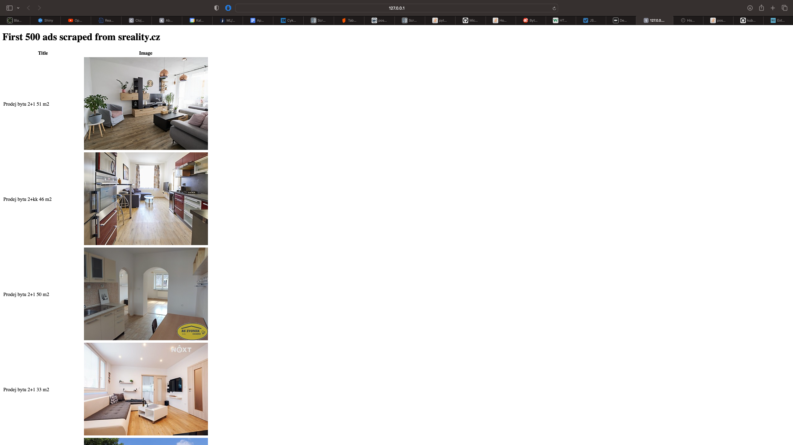

# sreality_scraper

## Task 
Use scrapy framework to scrape the first 500 items (title, image url) from sreality.cz (flats, sell) and save it in the Postgresql database. Implement a simple HTTP server in python and show these 500 items on a simple page (title and image) and put everything to single docker-compose command so that I can just run "docker-compose up" in the Github repository and see the scraped ads on http://127.0.0.1:8080 page.

## How to use
First you need to have docker installed. Then you can simply run 
```
docker compose up
```
This will start 3 containers. 
1. Postgres SQL database
2. Container with scrapy spider to dowload the data and save them to Posgres
3. Flask frontend displaying the data from Posgres

The server is run with guinicorn.

## Disclaimer

The service is not production ready. It is inteded to be used as a demonstration. Among other things the current version is missing:
1. proper logging and documentation
2. persistant longterm storage
3. static typechecking and linting
4. credentials (and other things) are hard-coded and visible
5. versions of third party libraries are not fixed

## Inerface


